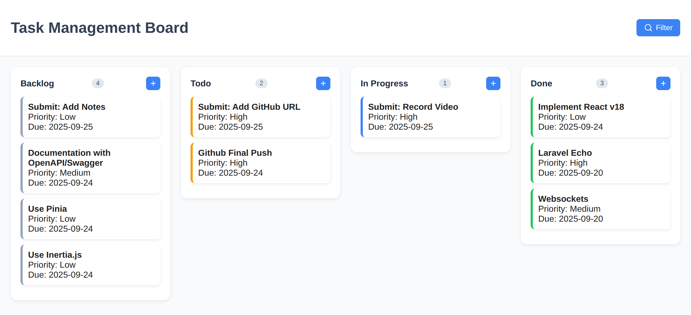

<h1 align="center"><a href="" target="_blank">Task Management - API (Laravel)</a></h1>



## Presentation Video Demo
- 3 minutes video
  - https://drive.google.com/file/d/11mDYD_GYjPHDrHDFemVHgPnOpyULIb-P/view

## Technologies
- Laravel 10
- Laravel Reverb (for updating tasks on board via websocket)
- Laravel Sail 
- Postgres 17
- Pest 2 (phpunit alternative for using DDD)

## Setup
- ``` composer install ```
- ``` php artisan sail:install ```
  - choose pgsql
- You may need to stop some services to avoid conflict with ports
    For instance:
        - ``` sudo service apache2 stop	```
            or - ``` /etc/init.d/apache2 stop	```        
- ``` alias sail='sh $([ -f sail ] && echo sail || echo vendor/bin/sail)' ```
  - OR use vendor/bin/sail for each sail command below
- In the project root folder, execute
        cp .env.example .env   
- ``` sail artisan migrate ```
- In case you want sample tasks
  - ``` sail artisan db:seed ```

To use Laravel Echo with Laravel Reverb, install:
- ``` sail artisan reverb:install ```
- After that, change .env:
  - use .env.example to copy and paste VITE_APP_NAME, REVERB_APP_ID and VITE_REVERB key/values
  - also change BROADCAST_DRIVER to reverb

To run Laravel Reverb
- ``` sail artisan reverb:start ```

To run tests
- ``` sail pest ```

## Assumptions
- Initially I considered status and priority columns as string/enum for simplicity, latelly I noticed it should be foreign keys so that I could use eager loading. If I had more time, I would fix that.
- Statuses: Backlog, Todo, In Progress and Done
- Priorities: Low, Medium and High
- The documentation with OpenAPI/Swagger was not implemented (lack of time)
